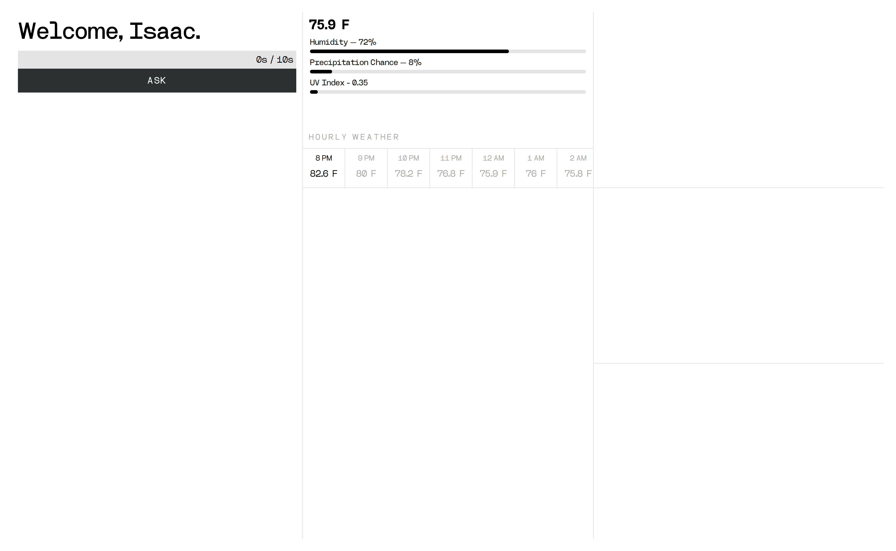

# Jarvis Wrapper React

This project is an Electron application written in React & TypeScript. It communicates with a python backend for realtime transcription, OpenAI API calls, and text to speech via websockets.

## Current Snapshot

## Features

- Wake word "Jarvis" using [Porcupine](https://github.com/Picovoice/porcupine)
- Realtime voice to text (transcription) using Google Speech-to-Text
- Communication with [GPT-5 Nano](https://platform.openai.com/docs/models/gpt-5-nano) that forms responses similar to J.A.R.V.I.S from Iron Man.
- Voice cloning (Jarvis voice sample) & streaming TTS inference using [XttsV2](https://github.com/coqui-ai/TTS)
- Weather data from [Open Meteo](https://open-meteo.com/)

## License

This project is licensed under the [MIT License](LICENSE).